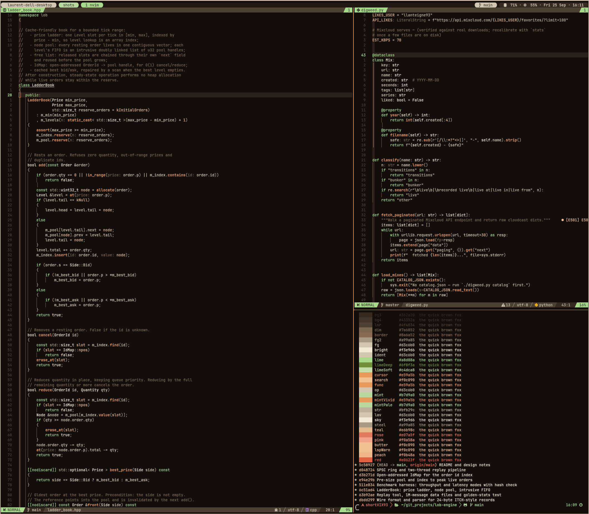

# dotfiles

My Linux desktop: awesome WM and polybar, kitty and alacritty, tmux, zsh, and a Neovim setup built for C++ and Python, in one of two themes that everything switches between together: spacecowboy, the main one, and voidrunner.

## What's here

| Path | What it is |
|---|---|
| `theme/` | The palette factory: two palettes, the renderer, the templates, the rendered bundles and `dye` |
| `nvim/` | Neovim on lazy.nvim: LSP, blink.cmp, treesitter, telescope, conform, DAP, gitsigns, snacks, and two colorschemes of my own, spacecowboy and voidrunner |
| `.tmux.conf`, `.tmux/scripts/tmux-sysstat` | tmux with vim-style navigation shared with Neovim, session persistence, and a non-blocking CPU and memory status script |
| `awesome/` | awesome WM: `rc.lua`, a Gruvbox theme, autostart and a screenshot helper |
| `polybar/` | The bar: workspaces, window title, CPU, memory, network, date and MPD |
| `kitty/`, `alacritty/` | Terminals; both include their colours from the theme bundle |
| `.zshrc`, `.zshenv`, `.p10k.zsh` | zsh on oh-my-zsh with powerlevel10k, fzf-tab, autosuggestions and syntax highlighting |
| `tuicr/` | tuicr config, with a rendered theme per palette |
| `lazygit/`, `bottom/`, `htop/`, `neofetch/`, `gtk-4.0/` | Smaller tool configs |
| `gitignore_global` | Global git ignore |

## The theme

Two palettes, each its own Neovim colorscheme: [spacecowboy](https://github.com/lanteignel93/spacecowboy.nvim) (a desert at night), the one this desktop wears and the default when no theme is picked, and [voidrunner](https://github.com/lanteignel93/voidrunner.nvim) (near-black ground, pale accents). `theme/` is the factory: one palette file per theme is the only place a colour is written by hand, `render.py` renders every tool's config and the Neovim plugin from it, and `dye <name>` re-points one link and reloads nvim, tmux, the shell, kitty and the rest. `theme/README.md` has the details, and each palette's `extras/` in the plugin repos carries the rendered files for other people.

## Using it

These are my configs, not a framework, so take whatever is useful. Most directories drop straight into `~/.config/` (`nvim/` becomes `~/.config/nvim`), and the zsh and tmux files go in your home directory.

A few things are installed separately:

- **zsh:** [oh-my-zsh](https://ohmyz.sh/), [powerlevel10k](https://github.com/romkatv/powerlevel10k), [fzf-tab](https://github.com/Aloxaf/fzf-tab), [zsh-autosuggestions](https://github.com/zsh-users/zsh-autosuggestions) and [zsh-syntax-highlighting](https://github.com/zsh-users/zsh-syntax-highlighting)
- **tmux plugins** through [tpm](https://github.com/tmux-plugins/tpm): vim-tmux-navigator, tmux-resurrect and tmux-continuum
- **awesome:** the [collision](https://github.com/Elv13/collision) module, cloned into `~/.config/awesome/collision`
- **polybar:** the icons need the Material Icons font

## Credits

- [darkvoid.nvim](https://github.com/aliqyan-21/darkvoid.nvim) by aliqyan-21, the origin of voidrunner's greys and accents
- [awesome-wm-gruvbox-theme](https://github.com/lnus/awesome-wm-gruvbox-theme) by lnus, the base of `awesome/themes/gruvbox`
- [polybar-gruvbox-theme](https://github.com/emgyrz/polybar-gruvbox-theme) by emgyrz, the base of `polybar/`

This repo is generated from my private dotfiles, so machine-specific pieces are left out.
